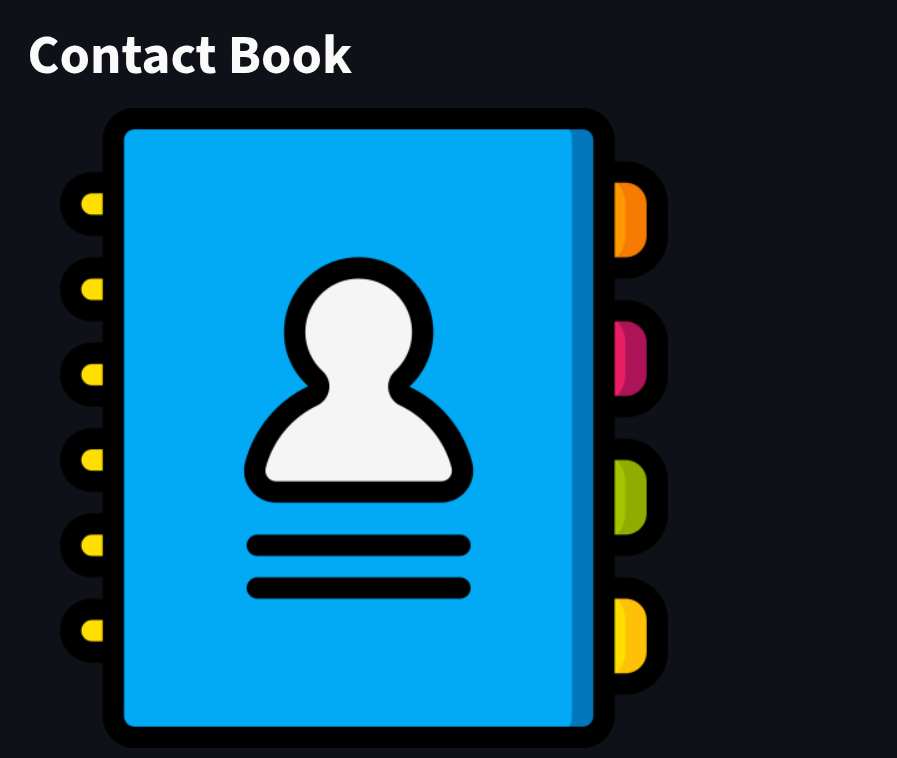
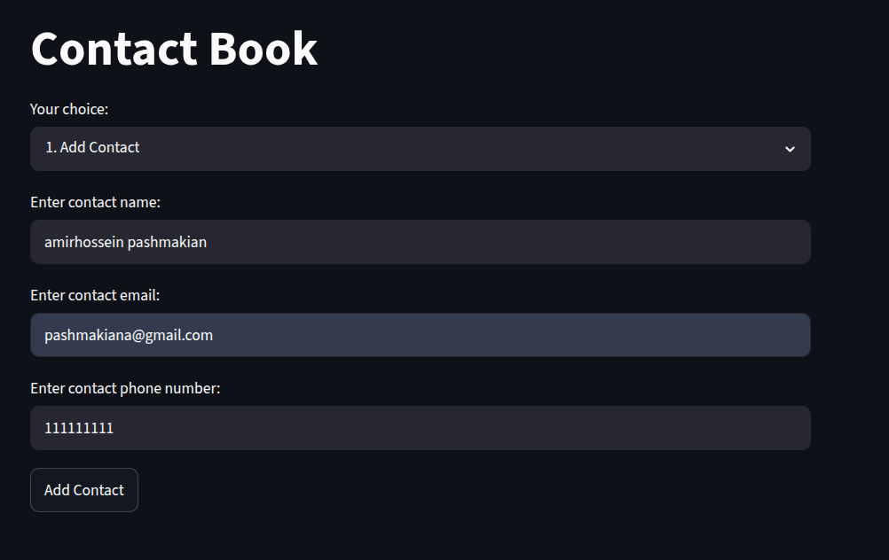
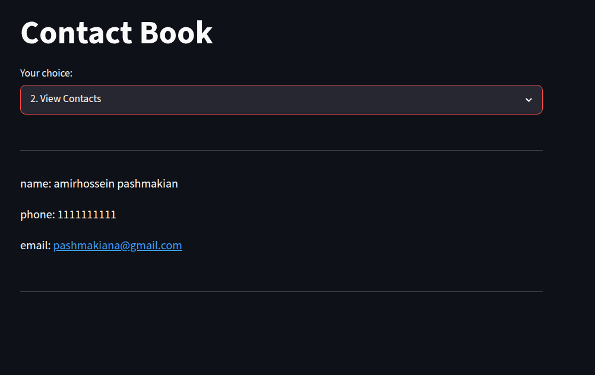

<p align="center">
  
</p>

<h1 align="center">📇 Contact Book</h1>

<p align="center">
  A simple contact management app built with <strong>Python</strong> and <strong>Streamlit</strong>.
</p>

---
## 🚀 Live Demo

Try the application online:

[Contact Book — Streamlit App](https://pashmakiana-contactbook.streamlit.app/)

## ✨ Features

- ➕ **Add Contact** — save a new contact with name, email, and phone number
- 👀 **View Contacts** — list all saved contacts
- ✏️ **Edit Contact** — update name, email, or phone number of an existing contact
- ❌ **Delete Contact** — remove a contact from the list
- 🚪 **Exit** — a friendly goodbye screen

---

## 🖼️ Screenshots

### Add Contact


### View Contacts


---

## 🛠️ Tech Stack

- **Python 3**
- **Streamlit** — for the web interface
- Core logic implemented in the `ContactBook` class (`main.py`)

---

## 🚀 Getting Started

### 1. Install dependencies
```bash
pip install streamlit
```

### 2. Run the app
```bash
streamlit run astreamlit/main.py
```

### 3. Open in browser
Streamlit will automatically open the app at:
```
http://localhost:8501
```

---

## 📂 Project Structure

```
.
├── solutions/
│   └── src/
│       └── main.py      # ContactBook class + CLI version
├── astreamlit/
│   └── main.py           # Streamlit web interface
├── images/                # Screenshots used in this README
└── README.md
```

---

## 📌 Notes

- Contact data is stored in memory (`st.session_state`) — it resets when the app restarts.
- Phone numbers are validated to contain digits only.
- Duplicate contact names are not allowed.

---

<p align="center">Made with ❤️ using Streamlit</p>


## 👤 Author

**Amir Hossein Pashmakian**
- Email : pashmakiana@gmail.com
- LinkedIn: https://www.linkedin.com/in/amirhossein-pashmakian-645909415/
- GitHub: https://github.com/pashmakiana-cell

